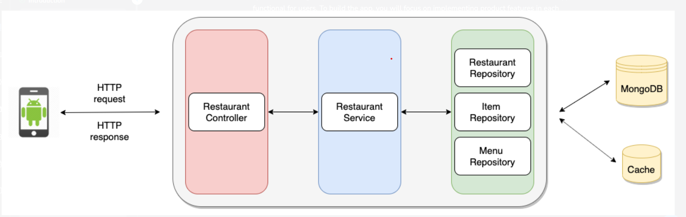
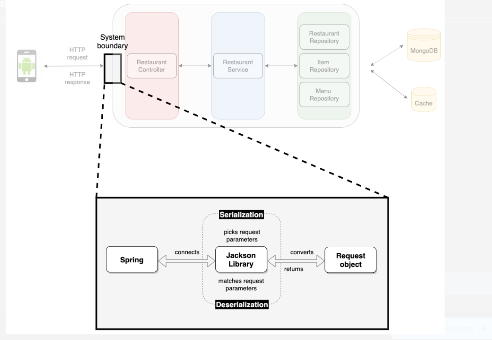

# QEATS

QEats is an app that makes food ordering convenient for millions of users. With just a few taps on their phone, users can relish their favorite food from nearby restaurants.

 

The app is not usable yet as the backend features are only partially implemented at the moment.

 

QEats is counting on you to build all the necessary backend features to make the end-to-end app functional for users. To build the app, you will focus on implementing product features in each part shown in the following QEats architecture diagram:

Objective
Support different frontend clients with the QEats backend server.

Focus Area

